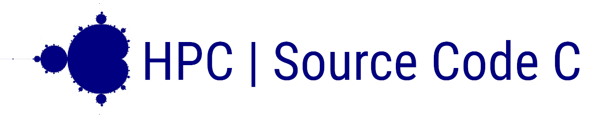

[](CHANGELOG.md)
[](CHANGELOG.md)
[](LICENSE.md)

>_"Oh say, can you C?"_

A storage of Source Code bits and pieces written in C for HPC.


## Description
Collection of standalone applications of high-performance code in pure C, for solving CPU-intensive computational problems. Files are structured into directories, according to the level of complexity, origin and purpose.


### Math
Applied math: number theory, linear algebra, complex numbers, etc.

- 64-bit prime integers calculator
- Fibonacci series
- approximate pi with the Nilakantha series
- algorithm for generating Mandelbrot set based on [Source](https://rosettacode.org/)

### Finance
Quantitative finance models and algorithms
- mortgage calculator
- perpetuity PV calculator

### Other
Astronomy, cryptography and other exciting stuff
- algorithm for approximating Lagrangian points L1, L2, L3 for Moon-Earth, Earth, Mars, Jupiter
- RSA encryption keys generator
- Caesar cipher for strings encryption

### Liners
Simple programs that do not fall into any particular cathegory


## Clone, Compile, Run
To make the source code executable, you need to compile it first. Source code follows C11 standard. Make sure your compiler is up to date or at least can handle C99.

Clone repository
```bash
git clone https://github.com/lialkaas/ican-c.git
```

Navigate to the folder in Terminal
```bash
cd ~/ican-c
```

Compile Source code into executable. Likely, in UNIX system _cc_ stands for alias of installed compiler. If not, call the name of your compiler directly (e.g. gcc, clang, etc.)
```bash
cc filename.c -o filename
```

Note: some apps depends on _math.h_, that requires _-lm_ flag for compiling.
```bash
cc filename.c -o filename -lm
```

Finally, run executable by calling it
```bash
./filename
```


## License and Copyright
Copyright (c) 2019 Oleksii Lialka

Licensed under the [MIT License](LICENSE.md).
